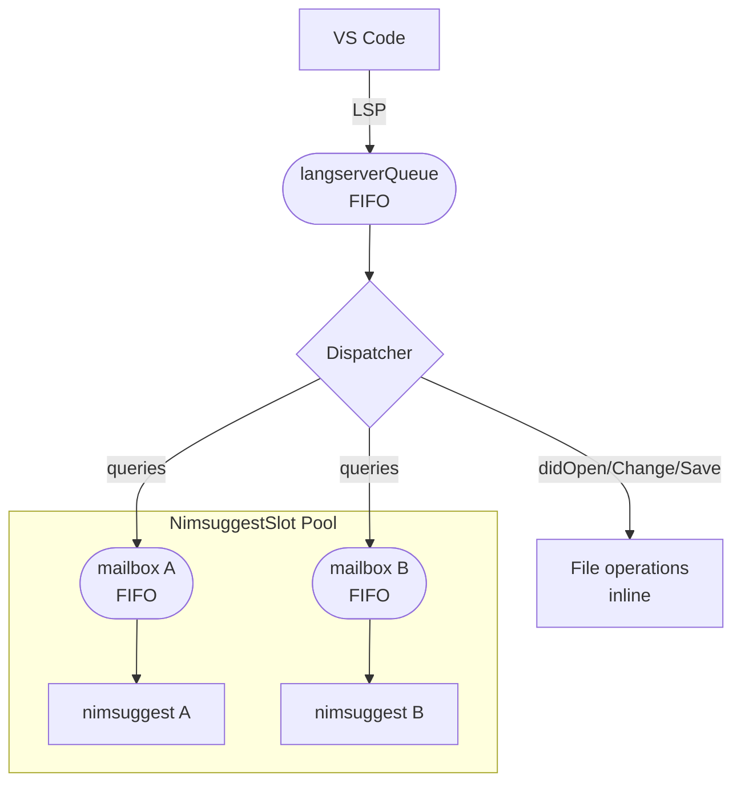

# Nim Tortoise

> *Slow and steady wins the race.*

*NOTE: This repo is in active, heavy development.*

*NOTE: All other READMEs are a work in progress*

## What is it?

A fork and rewrite of [`nimlangserver`](https://github.com/nim-lang/langserver) and [`vscode-nim`](https://github.com/nim-lang/vscode-nim).

This is a language server for the programming language `Nim`, and an accompanying VS Code extension.  The language server can act as a drop-in replace for `nimlangserver` for basic functionality or use it with the VS Code Extension.

The language server aims to prioritise correctness over speed.  In other words, it might work slower than the other nim language servers, but it will give you the correct information and not crash every 10 minutes.

## Motivations: Why Rewrite?

I have been writing `nim` code since 2022 and have been coding with it daily since 2023.  At no point during this period has the combination of `nimlangserver` + `IDE` worked correctly for any of my projects.  Although I mainly use VS Code, I tried a number of different IDEs, with the same results.  I tried almost every possible configurtion of extension, IDE, and language server - with me eventually deciding to run the official VS Code Extension with `nimsuggest` disabled, so I would get the text coloration but without it continuously rinsing my CPU at 100% for minutes at a time and destroying my battery-life.  

These were all inconveniences that I powered through because I enjoyed the language, and the downsides of IDE integration were much outweighed by the benefits of the progress I was making, 

Cut to July 2026, when the code base I am working in is over 100,000 lines of `nim` code in a monorepo with 30+ modules and.  I load up this project in VS Code only for it to take 1 minute and 45 secondd of `nimble` running at 100% on my CPU before any aspect of the language server even works, and then, when it does, it manages to correctly give highlights and diagnostics for about 5-10 minutes before irretrievably crashing.  This forced progress on my work to become almost stationary.  So I decided to try and fix things.  

My first steps were to correct some low-hanging fruit that was causing bugs with the official `nimlangserver` language server (e.g. there was no code that dealt with the `textDocument/rename` request, meaning that if a file was moved or renamed, `nimsuggest` would have no idea, and nothing would work for that file or the rest of the project).  I made some similar fixes to the `vscode-nim` VS Code Extension, fixing some problems involving placing extra guards to ensure no more `nimsuggest` processes were spawned than the user wanted, and fixing the 100% CPU at startup problem, which was the result of both VS Code not supplying the correct `PATH` information for the programs it spawned in the shell, nor correct configuration information for those programs when they ran, `nimble`'s SAT solver to kick-in because it wasn't being directed to the correct folder.  I made a few pull requests to the main repository and, although I made progress, it still wasn't working _well_.  

I basically needed the language server to do the following things:

- Does not crash after only 10 minutes of use.
- Does not give incorrect diagnostic or hover infirmation.
- Gives correct, and up-to-date diagnostics and hover information for any file you have open in your IDE.
- Go-to definition works.  For the entirety of your session.  And for any file.
- Is not constantly rinsing the CPU.
- Respects the maximum number of nimsuggest processes I specify.

These are the aims of Nim Tortoise.

Looking further at the code - and trying to fix the 15th race-condition-related bug - I realised that there were some architectural problems with the code base that necessitated a complete rewrite...

In this rewrite I prioritise three things:

- Correctness > Speed: The information the language server provides about your code should always be correct and up-to-date.  At every point correctness will be picked over speed.  I don't mind having to wait an extra second if it means the that my IDE is going to show me information that is actually right and relevant.  This is more tortoise than hare.
- Stability: The language server should be stable- not  constantly crashing - I have work to do!
- Efficiency: The language server does have to deal with a lot of files, but it shouldn't be turning your laptop into a stellar-hot chunk while its working.  I aim for the language server to be CPU light.  

## Problems

What follows is a documented catalogue of the problems in the original `nimlangserver` + `vscode-nim` combination that the rewrite is designed to fix. These are not isolated edge-case bugs: they are systemic issues rooted in architectural decisions that made correctness difficult by construction.

### The extension/server split

The most pervasive structural problem was that the boundary between the VS Code extension and the language server was never cleanly drawn. The extension contained its own direct nimsuggest integration — its own TCP socket management, its own query dispatch, its own `nimble dump` invocation — running in parallel with whatever the language server was doing. The result was two independent agents both issuing commands to the same nimsuggest process with no coordination between them.

In practice this meant:

- `setNimDir` in the extension ran `nimble dump` on every activation, before the language server even started. The language server then ran `nimble dump` again from its `initialized` handler. Both were talking to different versions of nimble with different PATH environments, and neither result was shared with the other.
- Language features (hover, completion, go-to-definition, diagnostics, inlay hints) had separate handler implementations in both the extension and the server — fifteen or more modules doing work that the LSP protocol already defines a standard channel for.
- State was duplicated. The extension and the server each tracked their own understanding of which files were open and which nimsuggest processes existed. These could diverge silently.

### Startup and configuration timing

Nimsuggest was spawned from the `initialize` handler, before any workspace configuration had been requested from the client. This meant `projectMapping`, `maxNimsuggestProcesses`, and all other routing rules were empty at spawn time. Processes were started with default settings and the configuration that arrived later was ignored or only partially applied.

The more painful variant of this: VS Code launched from the Dock (macOS) inherits a minimal `PATH` that does not include `~/.nimble/bin`. The extension found an older Homebrew nimble instead of the user's current version. That older nimble could not resolve Nim 2.x packages from the local cache and fell back to its exponential-time SAT solver (`findMinimalFailingSet`). The result was `nimble` running at 100% CPU for over a minute before the language server could do anything at all.

Even when nimble was found correctly, it was sometimes invoked with an absolute path passed as an argument when it expected a relative one, producing silently empty output. `entryPoints`, `nimDir`, and `srcDir` all came back as empty strings, and the server continued as though nothing had gone wrong.

A further timing problem: `withTimeout` on the workspace configuration future would cancel the shared future when the timeout expired. All other coroutines waiting on the same future lost their waiter simultaneously. The configuration that eventually arrived was never received by any of them.

### Nimsuggest imports and the cold-compilation problem

Nimsuggest was launched without the `--path:` flags generated by `nimble setup`. Without those flags, its internal compiler had to resolve every import by calling nimble itself — invoking the SAT solver on each one. For a project with many dependencies, cold-compilation took over 50 seconds. With `nimble.paths` correctly forwarded, the same compile took 10–15 seconds.

The working directory was also not set correctly for nimsuggest spawns. Without being pointed at the project root, nimsuggest could not find `config.nims` and its per-subpackage `--path:` entries, compounding the import resolution failures.

### Race conditions and concurrency

This is the largest category of bugs and the one that made patching futile — each fix exposed another race underneath it.

**No ordering guarantee on requests.** Handlers in many different parts of the codebase could call nimsuggest concurrently. A `didChange` stash write and the hover query that followed it could be interleaved arbitrarily. Nimsuggest would answer the hover against the old buffer content, and the user would see stale information with no error or indication that anything was wrong.

**Two incompatible dispatch paths coexisted.** The original TCP dispatch in `suggestapi.nim` was called directly from route handlers. A queue system existed alongside it but was not wired up — `checkFile` and `tryGetNimsuggest` both bypassed it. The queue ran in parallel with the direct dispatch, issuing duplicate commands to the same nimsuggest connection.

**`OrderedSet` mutation during iteration SIGSEGV.** `removeIdleNimsuggests` iterated `ns.openFiles` at the same time as `didCloseFile` mutated it. Nim's set implementation aborts with a SIGSEGV when the length changes mid-iteration. This was a reliable crash path for sessions with many short-lived files.

**Concurrent `didOpen` for the same URI.** The guard `if uri in ls.openFiles` was checked before any `await`. After the first `await` point, a second coroutine processing the same URI could pass the same guard. The second assignment would overwrite the first's completed `projectFile` future, leaving the file tracked against the wrong nimsuggest instance.

**Spawn limit bypass.** Three separate code paths spawned nimsuggest instances without checking `maxNimsuggestProcesses`: the project mapping match path, `initNimsuggestInstances`, and `getNimsuggestInner`. Concurrent `didOpen` handlers all observed count=0 before any spawn completed, so all of them would spawn — regardless of the configured limit.

**`errorCallback` cascade.** When `warnIfUnknown` deliberately stopped a nimsuggest process, in-flight TCP commands failed and fired `errorCallback`. That callback, not knowing the stop was intentional, treated it as a crash and automatically restarted the killed instance. This put the intentional shutdown and the automatic restart in competition with each other.

**Failed spawn sentinel blocks re-spawn permanently.** `createOrRestartNimsuggest` inserted a sentinel future into the process table before the first `await`. If the spawn then failed, the `except` clause logged the error but did not delete the sentinel. The pending future stayed in the table indefinitely. Every subsequent request for that project would wait 33 seconds (three retries × increasing backoff) before giving up — a silent, permanent hang.

**`didCloseFile` KeyError via stale `ns.openFiles`.** `ns.openFiles` was populated on `didOpen` but never cleared on `didClose`. After many open/close cycles, the set accumulated stale URIs. `cancelPendingFileChecks` iterated this set and crashed with `Table.[missing_key]` when it tried to look up a file that had long since been closed.

**Double write on a Future.** During slot eviction, pending queries were drained by completing their `responseFuture` with `@[]`. At the same time, `processNimsuggestQueries` might also be completing the same futures with real results. Writing to a Future twice violates Chronos's single-write invariant and produces undefined behavior.

### Crash recovery

Crash recovery was distributed across several subsystems — `crashedFiles`, `project.failed`, `project.errorCallback`, and auto-restart logic all lived in different files — and none of them told a consistent story.

When `execSpawn` caught a `CatchableError`, it set `state = CRASHED` and stopped. There was no automatic respawn. The slot stayed dead indefinitely. The only path back to a working nimsuggest was an explicit `RESTART` command issued from outside, which was itself stubbed.

When a crash did trigger auto-restart, there was no backoff. The restart was queued immediately. If the underlying cause (bad binary, missing file, bad config) persisted, the server entered a tight spin loop retrying at full CPU speed until `MAX_CRASH_RETRIES` was exhausted.

After a crash and respawn, only the file that triggered the crash was re-registered with the new nimsuggest process. All other open files were lost — nimsuggest had no knowledge of them and would return empty results for any query involving those files.

Evicted slots were never removed from `pool.slots`. After `EVICT_AND_SPAWN` sent `STOP`, the dead slot remained in the table as an idle shell. With many file opens over a long session, the table grew without bound.

### Position encoding

The LSP protocol uses 0-based line numbers and UTF-16 code-unit columns. Nimsuggest expects 1-based line numbers and UTF-8 byte columns. These coordinate systems agree for ASCII-only files and diverge for anything containing non-ASCII characters.

The original code did not perform this conversion correctly. `toUtf8Col` was called at query dispatch time, not at query creation time. Between creation and dispatch, a `didChange` could update the fingerTable for the file. The old position was then resolved against the new fingerTable, producing a wrong column. For files with Unicode identifiers, emoji in strings, or multi-byte comments, highlights and hover targets would point to the wrong locations in the source.

Compiler-internal symbol names were passed through unmodified to the IDE: `:anonymous`, `:result`, `:tmp`, `:env`, `:iterator`, `:objectType` (compiler-generated gensyms that never appear in source), and backtick-mangled names like `procName\`gensym0` (produced by template/macro expansion). These appeared verbatim in hover tooltips and completion lists, making it impossible to know which source token they corresponded to.

### Stash and save semantics

The stash mechanism — writing unsaved buffer content to a temporary file so nimsuggest can check in-progress edits — had two important bugs.

First, the stash path was derived using `hash(uri).toHex`, a 64-bit hash. Two different URIs with the same hash would silently corrupt each other's edit buffer. Hover and diagnostics would show the wrong content without any error.

Second, `didSave` did not tell nimsuggest to stop using the stash and revert to the on-disk file. Hover and diagnostics after a save continued to reflect the pre-save in-memory stash content until the session was restarted. Similarly, `checkFile` did not call `changed()` before `chkFile()`, so nimsuggest checked the stale cached AST from the previous save rather than the current buffer.

### Missing handlers

Several LSP notifications had no handler at all:

- **`workspace/didRenameFiles`**: entirely absent. After a file was renamed or moved, nimsuggest's module graph still referenced the old path. The next query triggered `getModule(fileIndex)` returning nil, `incl m.flags, sfDirty` on the nil module, and a SIGSEGV. The stash file was also left at the old path, and `openFiles` retained the stale URI. Hover, completion, and inlay hints stopped working for the renamed file and any file that imported it.
- **`workspace/didChangeConfiguration`**: incomplete. Changes to `nimsuggestIdleTimeout`, `projectMapping`, and hints settings were silently ignored. A full language server restart was required for any configuration change to take effect.
- **`extension/suggest` (restart action)**: stubbed. Users had no manual recovery path after a persistent crash.

### Nim check and nimsuggest running in parallel

The original codebase used both `nim check` and `nimsuggest` for diagnostics, depending on settings. When both were active, they ran concurrently against the same files, producing duplicate or contradictory diagnostic sets. `nim check` also added full compiler invocations on every save, contributing to the CPU spikes at startup and after edits.

## Nim Tortoise

I have rewritten the extension and language server to focus on doing one thing well:

- Giving correct information back to the IDE from the language server.

This has meant removing some functionality.  What has been removed:

- Test running: To get the information about what tests are running, the tests need to successfully compile using the nim compiler.  This causes big CPU spikes upon launching the IDE while it gets the test, and it will only succeed if the tests compile.  If I open up an IDE, why do I want to add extra wait time to an already slow startup procedure.
- MCP functionality: I decided to not support this until I can get the language server running correctly and robustly.
- Using `nim check` for checking files - everything now uses `nimsuggest`.
- Using `nimsuggest` rather than the full language server - this was a setting in `nimlangserver` but resulted in a lot of duplicated work.

## Improvements

### Architecture: the dispatcher and queuing model

All LSP work flows through a strict two-level pipeline. The diagram below shows the complete path from an IDE action to a nimsuggest response.



The key invariant: a `DID_CHANGE` stash write **always** completes before the hover (or any other nimsuggest query) that follows it, because both pass through the same FIFO `langserverQueue` in arrival order. Only after the file work is done does the nimsuggest query land in the slot's mailbox.

### VS Code extension pruned to an LSP-only wrapper

The original `vscode-nim` combined a VS Code extension with its own direct nimsuggest integration — approximately 4,764 lines of bespoke TCP protocol, elrpc RPC, flatDB local database, and 15+ language-feature modules, all talking to nimsuggest independently of whatever the language server was doing.

The rewrite strips all of that out. The extension is now ~270 lines of pure LSP client. Every language feature — hover, completion, go-to-definition, diagnostics, inlay hints, macro expansion, ARC expansion — comes from the language server over the standard LSP protocol. The extension's only job is to start the server and relay messages. No nim compiler, no nimsuggest socket, no nimble invocation ever runs inside the extension process.

### Startup performance

Startup is around 10–15 seconds for a 100,000+ line monorepo on a 2019 MacBook. The previous combination took over a minute before any language features were available (and often crashed before the minute was up).

Two changes drive this improvement: the extension now runs `nimble setup` automatically on first activation if `nimble.paths` is absent (generating all search paths in one fast pass, bypassing the SAT solver on every subsequent launch), and `nimble dump` results are cached per `.nimble` file so the expensive SAT solve only happens once per session.

### Correctness through serialisation

One of the primary causes of incorrect information in the old codebase was that many parts of the code could issue nimsuggest queries concurrently — racing each other to read from and write to the same TCP connection, producing stale responses, incorrect highlights, and occasional crashes.

The rewrite imposes a strict ordering guarantee via the two-level queue described above:

1. A single **FIFO `langserverQueue`** serialises every file operation and every nimsuggest request. A `didChange` stash write is guaranteed to complete before the hover query that follows it — no exceptions.
2. Each nimsuggest process has its own **per-slot `queryMailbox`**. Commands for the same process are serialised; commands for different processes run concurrently and independently.

### Stable process ownership

The old architecture tracked file-to-project ownership in two separate tables that had to be kept in sync by convention at every mutation site. The rewrite replaces this with a single `NlsFileInfo.slot` direct reference: each open file points directly to its `NimsuggestSlot`, and each slot owns a `HashSet` of URIs. There are no redirect aliases, no manual sync, no guards to check.

### Robust crash recovery

- Exponential backoff between restart attempts (1 s → 2 s → 4 s → … capped at 30 s)
- User notification via `window/showMessage` after repeated failures; the dead slot is removed from the pool rather than retried forever
- Correct re-registration of **all** open files after a restart, not just the file that triggered it
- No more infinite crash loops pegging the CPU

### Nimsuggest process pool

- Strictly enforces the `maxNimsuggestProcesses` limit via LRU eviction — slots in states `STOPPED` or `CRASHED` are evicted first, then `STOPPING`, then the least-recently-used `READY` slot
- **Consolidation**: when a newly spawned slot's nimsuggest already knows about files held by an existing slot, all those URIs are migrated to the new slot and the old one is torn down — no redundant processes
- Entry-point slots (discovered via `nimble dump`) are pre-spawned before the first `DID_OPEN`, so most files are handled immediately

### Accurate UTF-16 ↔ UTF-8 position translation

VS Code (and the LSP protocol) addresses positions as 0-based line numbers with UTF-16 code-unit columns. Nimsuggest expects 1-based line numbers with UTF-8 byte columns. These two coordinate systems diverge for any file containing non-ASCII characters.

The rewrite builds a **fingerTable** for every open file — a per-line mapping from UTF-16 code-unit offsets to UTF-8 byte offsets — regenerated on every `DID_CHANGE`. All nimsuggest queries convert through this table before dispatch. The original code did not perform this conversion, so highlights were always wrong for files containing Unicode identifiers, string literals with emoji, or multi-byte comments.

Additionally, compiler-internal symbol names are now handled correctly:

- **Colon-prefix gensyms** (`:anonymous`, `:result`, `:tmp`, `:env`, `:iterator`, `:objectType`) — these never appear in source and are filtered or displayed appropriately
- **Backtick-gensym suffixes** (e.g. `procName\`gensym0`) — the suffix added by template/macro expansion is stripped; only the source token before the backtick is shown

### Query deduplication and CPU throttling

Previously, every keystroke could fire a cascade of inlay-hint, document-symbol, hover, and diagnostic queries simultaneously, saturating the nimsuggest TCP connection and driving CPU usage to 90–99% during active editing.

The per-slot query processor now applies two layers of deduplication before dispatching anything:

- **Background queries** (`INLAY_HINTS`, `DOCUMENT_SYMBOLS`): dropped if a `CHANGED` query is pending in the mailbox or if the file was edited within `fileCheckDelay` milliseconds (default: 1000 ms)
- **Position queries** (`SUGGEST`, `HOVER`, `SIGNATURE_HELP`, etc.): dropped if a newer query of the same kind for the same URI is already queued, or if a `CHANGED` is pending

This brought observed CPU usage from 90–99% during editing down to under 25% for the same workload.

### Save semantics fixed

`DID_SAVE` now sends a `CHANGED` query with an empty `dirtyFile` parameter, explicitly telling nimsuggest to stop reading from the stash file and revert to the on-disk version. In the original code this step was absent, so hover and diagnostics after a save continued to reflect the pre-save in-memory content until the session was restarted.

Transitive dependencies are also handled: when a file is saved, nimsuggest re-checks all files that import it, propagating changes across module boundaries correctly.

### Configuration reliability

The configuration layer was rewritten from a state machine of `Option[T]` fields — prone to nil dereferences whenever an optional was unwrapped without a guard — to a simple `NlsConfig` object with non-optional fields and explicit defaults. Configuration values are now parsed by `nlsConfigFromJson`, which overlays incoming JSON onto those defaults and never produces a nil field. An `isDifferentFrom` comparison prevents unnecessary server restarts when configuration events arrive that don't actually change anything.

### Monorepo support

- **`projectMapping`**: regex-based file-to-project routing lets each file in a monorepo be directed to the correct nimsuggest instance without manual intervention
- **`workingDirectoryMapping`**: per-project working-directory override for non-standard layouts
- **`nimTortoise.test.entryPoints`**: array of test entry points (one per sub-project) for the test runner, falling back to the singular `test.entryPoint` for single-project repos

### Other extension improvements

- **PATH augmentation**: `~/.nimble/bin` is prepended to the environment of every child process, ensuring `nim`, `nimble`, and `nimsuggest` are found regardless of how VS Code was launched (GUI launch vs. terminal launch differ in the `PATH` they inherit)
- **`nimTortoise.` namespace**: all settings and commands use this prefix, allowing the extension to coexist with or replace `vscode-nim` without key conflicts
- **Socket transport**: an alternative `transportMode: "socket"` connects the extension to a running language server on a TCP port, enabling a debugger to be attached to the server process during development
- **Exception inlay hints**: exception annotations are rendered as editor underline decorations with configurable prefix symbols (`nimTortoise.inlayHints.exceptionHints.hintStringLeft/Right`) rather than inline text hints, making them visually distinct
- **Nimble task code lenses**: tasks in `.nimble` files are surfaced as clickable `$(play-circle) Run task` code lenses directly in the editor
- **Debug integration**: CodeLLDB launch configurations are generated automatically for the active file or project

---

## Reflections (by Claude)

Nim Tortoise started as a collection of targeted bug fixes — a renamed-file handler here, a `PATH` guard there — and grew into a ground-up rewrite once it became clear that the underlying architecture could not be patched into correctness. The core insight driving everything is simple: a language server is a concurrent system serving a single logical resource (the nimsuggest process), and that resource must be accessed under strict ordering guarantees, not optimistic concurrency.

The two-level queue architecture is the rewrite's central success. By funnelling every file event and every nimsuggest query through the same FIFO before anything reaches nimsuggest, the entire class of race-condition bugs — stale hover responses, duplicate diagnostics, incorrect highlights after a rename — is eliminated structurally rather than patched case by case. The same queue enables the deduplication and throttling that keeps CPU usage low: the processor simply inspects what is already waiting in the mailbox before committing to a query.


## Known Limitations

### Stubbed features

- **Macro expansion** (`extension/macroExpand`): always returns null. The "Expand Macro" hover action in VS Code produces no output.
- **`didChangeConfiguration` over-restarts**: any change to the configuration — including toggling a single inlay hint category — triggers a full pool teardown and rebuild, incurring the cold-compile penalty for every slot.

## What's in This Repository

| Directory | What it is |
|-----------|------------|
| [`langserver/`](langserver/) | The Nim language server — a ground-up rewrite of `nimlangserver` |
| [`vscode_extension/`](vscode_extension/) | The VS Code extension — an LSP-only fork of `vscode-nim` |

The two components are designed to work together but are independent. The language server speaks standard LSP and will work with any LSP-capable editor.

You should be able to use `nimtortoise` as a drop-in replacement for `nimlangserver`, but I would recommend using the VS Code extension, as it removes many inefficiencies.

## Getting Started

### Requirements

- Nim with `nimsuggest` (`--v4` support, i.e. Nim 1.6+)
- `nimble >= 0.16.1`
- VS Code `>= 1.99.0` (for the extension)

### Build the language server

```sh
cd langserver
nimble build      # produces the nimtortoise binary
```

### Build and install the VS Code extension

```sh
cd vscode_extension
nimble vsix            # packages out/vscode_nim_tortoise-<version>.vsix
nimble install_vsix    # installs it into VS Code
```

The extension is written in Nim and compiled to JavaScript. It is not a TypeScript extension.

### Point the extension at the binary

Add to `.vscode/settings.json` in your project:

```json
{
  "nimTortoise.lsp.path": "/path/to/your/nimtortoise"
}
```

Currently, I haven't set up the extension to automatically compile and use the nimtortoise server, so you'll have to build the server from source, using `nimble build`, store it somewhere, then build the extension, and set up the `settings.json` in your project to point the "nimTortoise.lsp.path" setting to the compiled `nimtortoise` binary.  This will be fixed in later versions.

If omitted, the extension defaults to the `nimlangserver` server, and  searches `~/.vscode-nim-tortoise/nimbledeps/bin/nimlangserver` then `nimlangserver` in `PATH`.

---

## All Settings Use `nimTortoise.`

This extension uses the `nimTortoise.` prefix for all settings and commands to avoid conflicts with the original `vscode-nim` extension. The two **cannot be installed simultaneously** — this extension replaces the original.

Key settings at a glance:

| Setting | Default | What it does |
|---------|---------|--------------|
| `nimTortoise.lsp.path` | `""` | Path to the language server binary (falls back to `nimlangserver` in PATH) |
| `nimTortoise.nimsuggestPath` | `"nimsuggest"` | Path to the nimsuggest binary |
| `nimTortoise.maxNimsuggestProcesses` | `2` | Max nimsuggest processes (0 = unlimited) |
| `nimTortoise.maxNimsuggestCrashRetries` | `3` | Restart attempts before a crashed nimsuggest is abandoned |
| `nimTortoise.nimsuggestIdleTimeout` | `120000` | Idle timeout in ms before stopping a nimsuggest process |
| `nimTortoise.projectMapping` | `[]` | Per-file project mapping via regex |
| `nimTortoise.workingDirectoryMapping` | `[]` | Override the working directory used when running nimsuggest for a given project |
| `nimTortoise.checkOnSave` | `false` | Run project-wide diagnostics on save |
| `nimTortoise.fileCheckDelay` | `1000` | Quiet period in ms after last edit before per-file diagnostics run |
| `nimTortoise.formatOnSave` | `false` | Format with `nph` on save |
| `nimTortoise.inlayHints.typeHints.enable` | `true` | Show inferred type annotations |
| `nimTortoise.inlayHints.parameterHints.enable` | `true` | Show parameter name hints |
| `nimTortoise.inlayHints.exceptionHints.enable` | `true` | Show exception inlay hints |
| `nimTortoise.nimExpandMacro` | `false` | Expand macro calls on hover |
| `nimTortoise.nimExpandArc` | `false` | Expand ARC on proc definition hover |
| `nimTortoise.transportMode` | `"stdio"` | Transport to connect to the language server (`stdio` or `socket`) |

Full settings reference is in [vscode_extension/README.md](vscode_extension/README.md).

---

## Documentation

- [langserver/README.md](langserver/README.md) — how nimsuggest and the language server work together, best practices for project setup, architecture details
- [vscode_extension/README.md](vscode_extension/README.md) — full settings reference, commands, debugging setup, test runner, development guide

---

## Acknowledgements

This project builds on the work of:

- The [nimlangserver](https://github.com/nim-lang/langserver) team
- [@saem](https://github.com/saem) for [vscode-nim](https://github.com/saem/vscode-nim)
- [@kosz78](https://marketplace.visualstudio.com/items?itemName=kosz78.nim) for the original TypeScript Nim extension
