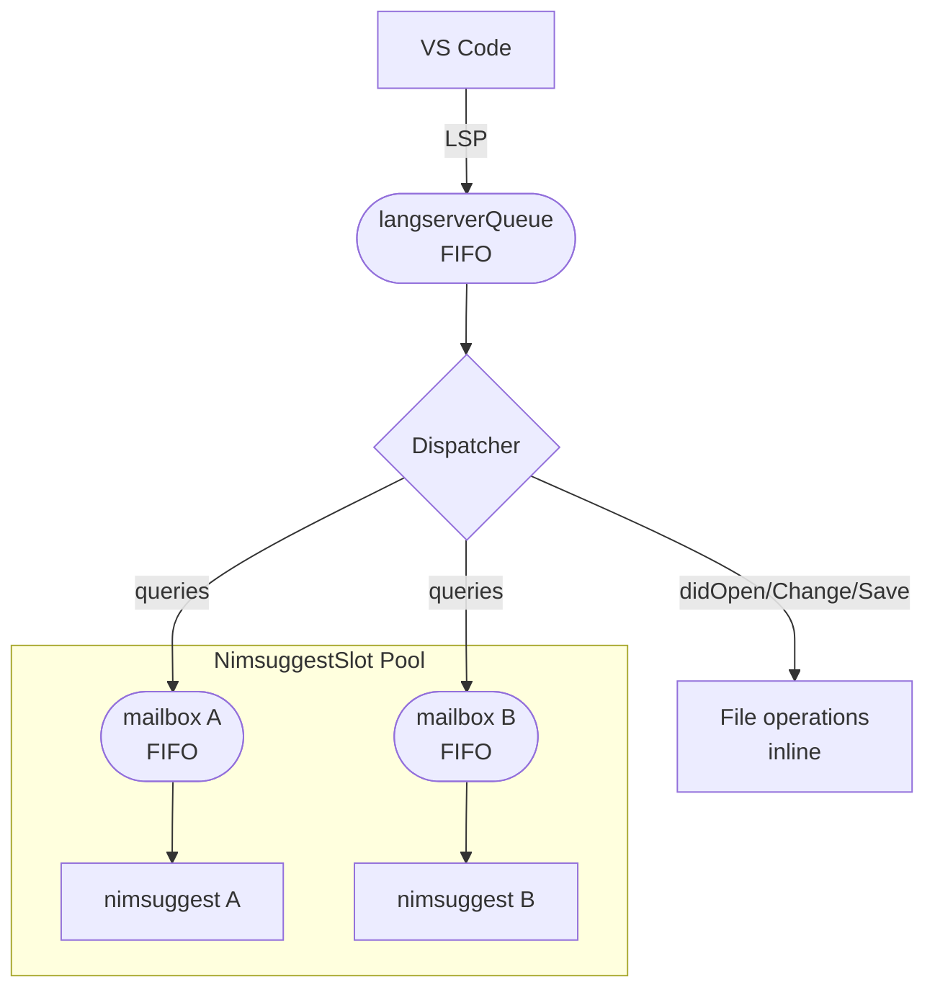

# v0.1.0

### Architecture: the dispatcher and queuing model

All LSP work flows through a strict two-level pipeline. The diagram below shows the complete path from an IDE action to a nimsuggest response.

The key invariant: a `DID_CHANGE` stash write **always** completes before the hover (or any other nimsuggest query) that follows it, because both pass through the same FIFO `langserverQueue` in arrival order. Only after the file work is done does the nimsuggest query land in the slot's mailbox.

### VS Code extension pruned to an LSP-only wrapper

The original `vscode-nim` combined a VS Code extension with its own direct nimsuggest integration — approximately 4,764 lines of bespoke TCP protocol, elrpc RPC, flatDB local database, and 15+ language-feature modules, all talking to nimsuggest independently of whatever the language server was doing.

The rewrite strips all of that out. The extension is now ~270 lines of pure LSP client. Every language feature — hover, completion, go-to-definition, diagnostics, inlay hints, macro expansion, ARC expansion — comes from the language server over the standard LSP protocol. The extension's only job is to start the server and relay messages. No nim compiler, no nimsuggest socket, no nimble invocation ever runs inside the extension process.

### Startup performance

Startup is around 10–15 seconds for a 100,000+ line monorepo on a 2019 MacBook. The previous combination took over a minute before any language features were available (and often crashed before the minute was up).

Two changes drive this improvement: the extension now runs `nimble setup` automatically on first activation if `nimble.paths` is absent (generating all search paths in one fast pass, bypassing the SAT solver on every subsequent launch), and `nimble dump` results are cached per `.nimble` file so the expensive SAT solve only happens once per session.

`~/.nimble/bin` is prepended to the environment of every child process, ensuring `nim`, `nimble`, and `nimsuggest` are found regardless of how VS Code was launched (GUI launch vs. terminal launch differ in the `PATH` they inherit)

### Correctness through serialisation

One of the primary causes of incorrect information in the old codebase was that many parts of the code could issue nimsuggest queries concurrently — racing each other to read from and write to the same TCP connection, producing stale responses, incorrect highlights, and occasional crashes.

The rewrite imposes a strict ordering guarantee via the two-level queue described above:

1. A single **FIFO `langserverQueue`** serialises every file operation and every nimsuggest request. A `didChange` stash write is guaranteed to complete before the hover query that follows it — no exceptions.
2. Each nimsuggest process has its own **per-slot `queryMailbox`**. Commands for the same process are serialised; commands for different processes run concurrently and independently.

### Stable process ownership

The old architecture tracked file-to-project ownership in two separate tables that had to be kept in sync by convention at every mutation site. The rewrite replaces this with a single `NlsFileInfo.slot` direct reference: each open file points directly to its `NimsuggestSlot`, and each slot owns a `HashSet` of URIs. There are no redirect aliases, no manual sync, no guards to check.

### Robust crash recovery

- Exponential backoff between restart attempts (1 s → 2 s → 4 s → … capped at 30 s)
- User notification via `window/showMessage` after repeated failures; the dead slot is removed from the pool rather than retried forever
- Correct re-registration of **all** open files after a restart, not just the file that triggered it
- No more infinite crash loops pegging the CPU

### Nimsuggest process pool

- Strictly enforces the `maxNimsuggestProcesses` limit via LRU eviction — slots in states `STOPPED` or `CRASHED` are evicted first, then `STOPPING`, then the least-recently-used `READY` slot
- **Consolidation**: when a newly spawned slot's nimsuggest already knows about files held by an existing slot, all those URIs are migrated to the new slot and the old one is torn down — no redundant processes
- Entry-point slots (discovered via `nimble dump`) are pre-spawned before the first `DID_OPEN`, so most files are handled immediately

### Accurate UTF-16 ↔ UTF-8 position translation

VS Code (and the LSP protocol) addresses positions as 0-based line numbers with UTF-16 code-unit columns. Nimsuggest expects 1-based line numbers with UTF-8 byte columns. These two coordinate systems diverge for any file containing non-ASCII characters.

The rewrite builds a **fingerTable** for every open file — a per-line mapping from UTF-16 code-unit offsets to UTF-8 byte offsets — regenerated on every `DID_CHANGE`. All nimsuggest queries convert through this table before dispatch. The original code did not perform this conversion, so highlights were always wrong for files containing Unicode identifiers, string literals with emoji, or multi-byte comments.

Additionally, compiler-internal symbol names are now handled correctly:

- **Colon-prefix gensyms** (`:anonymous`, `:result`, `:tmp`, `:env`, `:iterator`, `:objectType`) — these never appear in source and are filtered or displayed appropriately
- **Backtick-gensym suffixes** (e.g. `procName\`gensym0`) — the suffix added by template/macro expansion is stripped; only the source token before the backtick is shown

### Query deduplication and CPU throttling

Previously, every keystroke could fire a cascade of inlay-hint, document-symbol, hover, and diagnostic queries simultaneously, saturating the nimsuggest TCP connection and driving CPU usage to 90–99% during active editing.

The per-slot query processor now applies two layers of deduplication before dispatching anything:

- **Background queries** (`INLAY_HINTS`, `DOCUMENT_SYMBOLS`): dropped if a `CHANGED` query is pending in the mailbox or if the file was edited within `fileCheckDelay` milliseconds (default: 1000 ms)
- **Position queries** (`SUGGEST`, `HOVER`, `SIGNATURE_HELP`, etc.): dropped if a newer query of the same kind for the same URI is already queued, or if a `CHANGED` is pending

This brought observed CPU usage from 90–99% during editing down to under 25% for the same workload.

### Save semantics fixed

`DID_SAVE` now sends a `CHANGED` query with an empty `dirtyFile` parameter, explicitly telling nimsuggest to stop reading from the stash file and revert to the on-disk version. In the original code this step was absent, so hover and diagnostics after a save continued to reflect the pre-save in-memory content until the session was restarted.

Transitive dependencies are also handled: when a file is saved, nimsuggest re-checks all files that import it, propagating changes across module boundaries correctly.

### Monorepo support

Entry point routing is now handled automatically by the Forest (see 0.1.4 release notes). The language server discovers every `.nimble` file in the workspace, runs `nim dump` on each entry point, and routes each opened file to the correct nimsuggest instance without any manual configuration. The former `projectMapping` and `workingDirectoryMapping` settings have been removed.

- **`nimTortoise.test.entryPoints`**: array of test entry points (one per sub-project) for the test runner, falling back to the singular `test.entryPoint` for single-project repos
